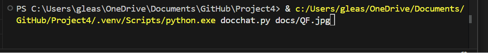

# docchat


DocChat is a chatbot that allows users to ask questions and engage in continuous conversations about documents.



Text examples:

```
$ python docchat.py decleration.txt

docchat> what is this document about
DOCCHAT: This document appears to be a collection of species profiles, highlighting unique and interesting facts about five different animals: the Peregrine Falcon, Axolotl, Quokka, Mantis Shrimp, and Orangutan.

docchat> tell me about the dolphin in this document
DOCCHAT: There is no mention of a dolphin in this document.

**Supported Document Types:**
- HTML files
- PDFs
- Webpages
- Images

## Installation

Install the dependencies with the following line:
```
$ pip3 install -r requirements.txt
```
